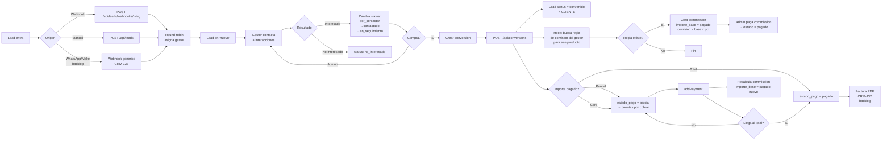
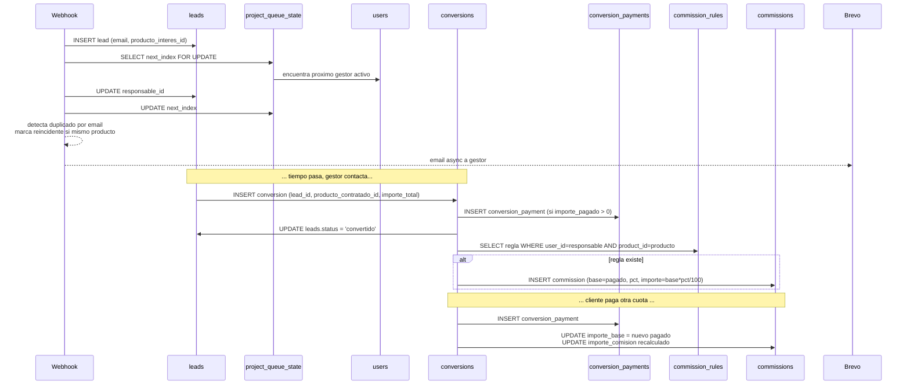
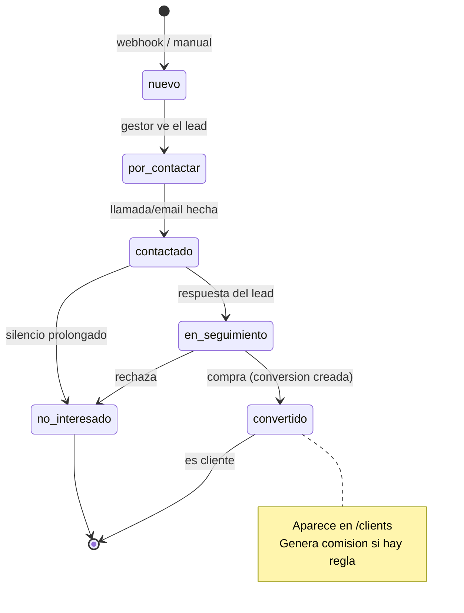
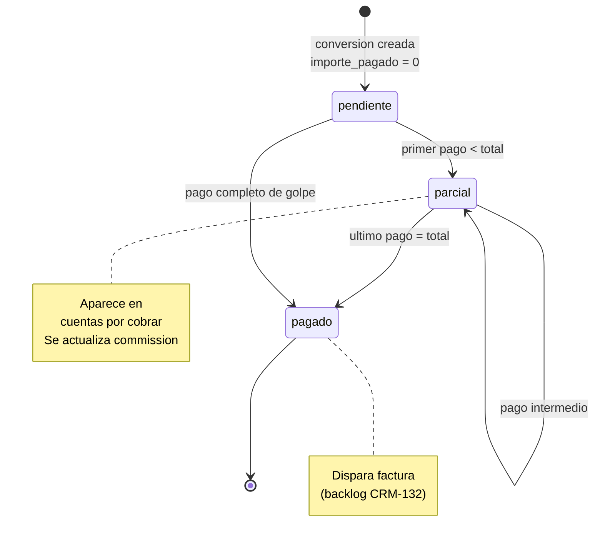

# Flujo principal: Lead → Conversion → Comision → Factura

## Flujo macro



## Flujo de datos entre tablas



## Ciclo de vida del lead



## Ciclo de vida de la conversion/pago



## Flujo de comision

```mermaid
flowchart TD
    A[Superadmin define regla] --> B[commission_rules<br/>user_id + product_id + pct]
    B --> C[UNIQUE user_id + product_id]

    D[Gestor cierra venta] --> E[conversion.create hook]
    E --> F{Regla existe<br/>user responsable + producto?}
    F -->|No| G[Sin comision]
    F -->|Si| H[INSERT commission<br/>base = importe_pagado actual<br/>importe = base * pct / 100<br/>estado = pendiente]

    I[Cliente paga cuota] --> J[conversion.addPayment hook]
    J --> K[recalculateCommission<br/>importe_base = nuevo pagado<br/>UPDATE importe_comision]

    L[Admin marca como pagada] --> M[PATCH /api/commissions/:id/pay<br/>estado = pagado<br/>fecha_pago = hoy]

    H -.->|vista gestor| N[/commissions/me]
    H -.->|vista admin| O[/commissions]
    K -.->|vista ambas| N
    K -.->|vista ambas| O
    M --> O
```

## Webhook → Lead: detalle

```mermaid
sequenceDiagram
    participant Ext as Formulario externo
    participant N as Nginx
    participant API as Backend
    participant DB as PostgreSQL
    participant BR as Brevo

    Ext->>N: POST /testeo_crm/api/leads/webhooks/psiko-aprende<br/>X-API-Key: whk_psiko_...
    N->>API: Proxy a localhost:3002
    API->>API: valida api_key del proyecto
    API->>DB: BEGIN transaction
    API->>DB: SELECT project_queue_state FOR UPDATE
    API->>DB: SELECT gestores activos del proyecto<br/>ORDER BY array position, active
    API->>DB: INSERT leads (responsable_id = gestor[next_index])
    API->>DB: UPDATE queue_state.next_index = (next+1) % count
    API->>DB: INSERT lead_utms
    API->>DB: SELECT leads WHERE email=? duplicate<br/>si mismo producto → reincidente = true
    API->>DB: COMMIT
    API-->>Ext: 200 {success, lead_id} &lt;500ms
    API-)BR: async: sendLeadAssignedEmail a gestor
```
