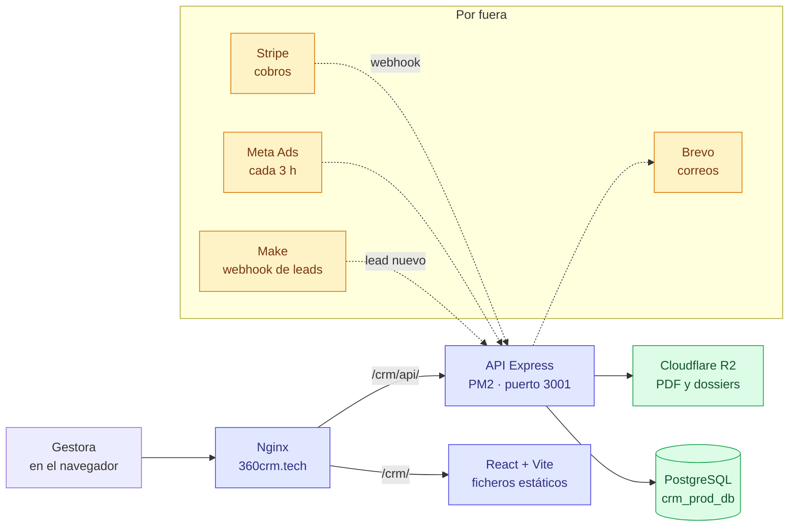
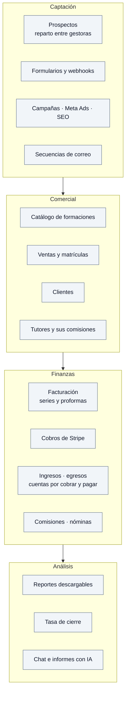
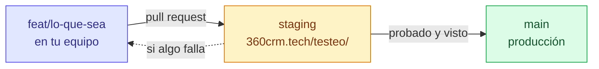

# 360 CRM · MultiProyecto

CRM interno para gestionar prospectos, ventas, facturación y publicidad de
varias marcas formativas a la vez. Un solo CRM, nueve proyectos dentro, cada uno
con sus productos, sus gestoras y su facturación.

Tiene un **CRM hermano**, [`CRM-ISEIE`](https://github.com/diego-landaeta/CRM-ISEIE),
con las mismas funciones y otra marca. **Lo que se hace en uno se hace en el
otro** — ver [`docs/PARIDAD-ENTRE-CRMS.md`](docs/PARIDAD-ENTRE-CRMS.md).

## Dónde está

| Rama | Entorno | Dirección | Base de datos | PM2 |
|---|---|---|---|---|
| `main` | Producción | https://360crm.tech/crm/ | `crm_prod_db` | `crm-api-production` :3001 |
| `staging` | Pruebas | https://360crm.tech/testeo/ | `crm_test_db` | `crm-api-staging` :3002 |
| `feat/*` | Desarrollo | en tu equipo | desechable, en Docker | — |

**Nada de datos reales en tu equipo.** El entorno local levanta su propia base
en Docker con datos de mentira, y los tests se niegan a arrancar si
`DATABASE_URL` apunta a un servidor de verdad.

### Los nueve proyectos

ISEIH · Psiko Aprende · Fono Aprende · ICTESS · ACADEMIA IA · ISAEG · ISSLOGG ·
ISECD · ISEF

Los tres últimos están recién creados y todavía sin actividad. Los proyectos de
IA (Psicólogo IA, Nutricionista IA, Tarot IA) **aún no están dados de alta**:
es la tarea [`docs/tarea-stripe-proyectos-ia.md`](docs/tarea-stripe-proyectos-ia.md).

---

## Cómo está montado



**Sin ORM.** Consultas SQL directas con `pg`. Validación de lo que entra con Zod.

---

## Qué hace



Estado real de cada pieza —lo que está en producción, lo que solo en pruebas y
lo que falta— en **[`docs/ESTADO-Y-PENDIENTES.md`](docs/ESTADO-Y-PENDIENTES.md)**,
con diagramas.

---

## Empezar en tu equipo

Hacen falta **Node 20 o superior**, **Docker** y **git**. Nada más: ni acceso al
servidor, ni credenciales de producción.

```bash
git clone https://github.com/diego-landaeta/CRM.git
cd CRM

# 1 · la base de datos, en Docker, con datos de mentira
cd backend
npm install
npm run db:arriba      # levanta PostgreSQL
npm run db:preparar -- --datos   # aplica las migraciones Y siembra datos de mentira

# 2 · la API
npm run dev            # http://localhost:3001

# 3 · el frontal, en otra terminal
cd ../frontend
npm install
npm run dev            # http://localhost:5173
```

Sin `--datos` solo se aplican las migraciones y la base queda vacía.

Para tirar la base y volver a empezar: `npm run db:abajo && npm run db:arriba && npm run db:preparar -- --datos`.

**Los tests** (Vitest, contra la base de Docker):

```bash
cd backend && npm test      # 511 pruebas
cd frontend && npm test     # 467 pruebas
```

> **La base tiene que estar levantada.** Sin ella, 8 ficheros del backend fallan
> con `ECONNREFUSED` y sus **119 pruebas se saltan sin avisar de forma visible**:
> la salida dice «passed» y en realidad no se ha ejecutado un tercio de la
> suite. Así estuvo meses, y por eso nadie vio que 9 de ellas estaban rojas —
> una era un fallo de producción de verdad (#70).
>
> Si ves `skipped` en el resumen, te falta `npm run db:arriba`.

---

## Cómo se trabaja



- Rama por tarea, **pull request a `staging`**. A `main` no se va directo si toca
  dinero, sesiones o el esquema de la base.
- **Migraciones**: un fichero nuevo en `backend/migrations/`, numerado. **No se
  ejecuta SQL a mano en el servidor** — las aplica quien despliega.
- **Commits en español**, con prefijo: `feat:`, `fix:`, `refactor:`, `docs:`,
  `chore:`, `test:`.
- Nunca se sube `.env`, `node_modules/` ni `dist/`.

---

## Cómo está repartido el código

Un directorio por dominio. Dentro va todo lo suyo: rutas, controlador, servicio,
modelo y validación.

```
backend/
  src/
    modules/          43 módulos: leads, conversions, invoices, tutores...
      <dominio>/
        index.js            exporta { prefix, router }
        <dominio>.routes.js
        <dominio>.controller.js
        <dominio>.service.js
        <dominio>.model.js
        <dominio>.validation.js
    shared/           configuración, middleware, utilidades
    jobs/             tareas programadas (Meta, Stripe, recordatorios)
    bundles/          qué módulos se encienden en cada instalación
    app.js
  migrations/         126 ficheros SQL, en orden. La verdad del esquema
  tests/              Vitest

frontend/
  src/
    modules/          44 módulos, en espejo con el backend
      <dominio>/
        api/ hooks/ components/ pages/
    shared/           componentes comunes, cliente de API, utilidades
    contexts/         sesión y proyecto activo
```

**Para añadir un módulo al backend**: crea el directorio, exporta
`{ prefix, router }` en su `index.js`, regístralo en `app.js` y añádelo al
paquete que le toque en `src/bundles/manifest.js` — si no, responde 404 y parece
que no existe.

---

## Reglas que no se negocian

- **El dinero sale de los cobros** (`conversion_payments`), no del campo
  `importe_pagado` de la venta: ese no cuadra, y no en la misma dirección en los
  dos CRMs.
- **Contraseñas** con bcrypt de coste 12. Sesión de 15 minutos, renovación de 30
  días en cookie `httpOnly`.
- **Cada gestora ve lo suyo.** El recorte se hace en el controlador, con el
  identificador de la sesión, nunca con lo que llegue por la URL.
- **Credenciales cifradas en la base** (AES-256), configurables desde el panel.
  En el `.env` solo lo imprescindible.
- **Round-robin de leads dentro de una transacción.** Nunca fuera.
- **Redondeo en SQL** con `ROUND(...,2)`, no con `toFixed` de JavaScript: no
  redondean igual y sobre miles de pagos se nota.

---

## Documentación

| Documento | Para qué |
|---|---|
| [`docs/ESTADO-Y-PENDIENTES.md`](docs/ESTADO-Y-PENDIENTES.md) | Qué hay hecho, qué falta y quién lo lleva. **Empieza aquí** |
| [`docs/README.md`](docs/README.md) | Esquema de base de datos, endpoints y despliegue |
| [`docs/PARIDAD-ENTRE-CRMS.md`](docs/PARIDAD-ENTRE-CRMS.md) | Qué se copia al CRM hermano y qué no |
| [`docs/tutores-pendiente.md`](docs/tutores-pendiente.md) | El módulo de tutores, en detalle |
| [`docs/tarea-stripe-proyectos-ia.md`](docs/tarea-stripe-proyectos-ia.md) | Tarea abierta: Stripe en los proyectos IA |
| [`docs/AUDITORIA-FINANZAS-CRM.md`](docs/AUDITORIA-FINANZAS-CRM.md) | Revisión de los doce módulos de finanzas |
| [`CLAUDE.md`](CLAUDE.md) | Convenciones, para trabajar con Claude Code |

---

## Quién es quién

| | |
|---|---|
| **Manuel Casas** | Propietario · superadmin |
| **Diego** | Desarrollo, base de datos y despliegues |
| **Ángel** | Desarrollo · rama `feat/stripe-ia` |
| **Carlos** | Dirección comercial · pide y valida los informes |

Repositorio **privado**.
