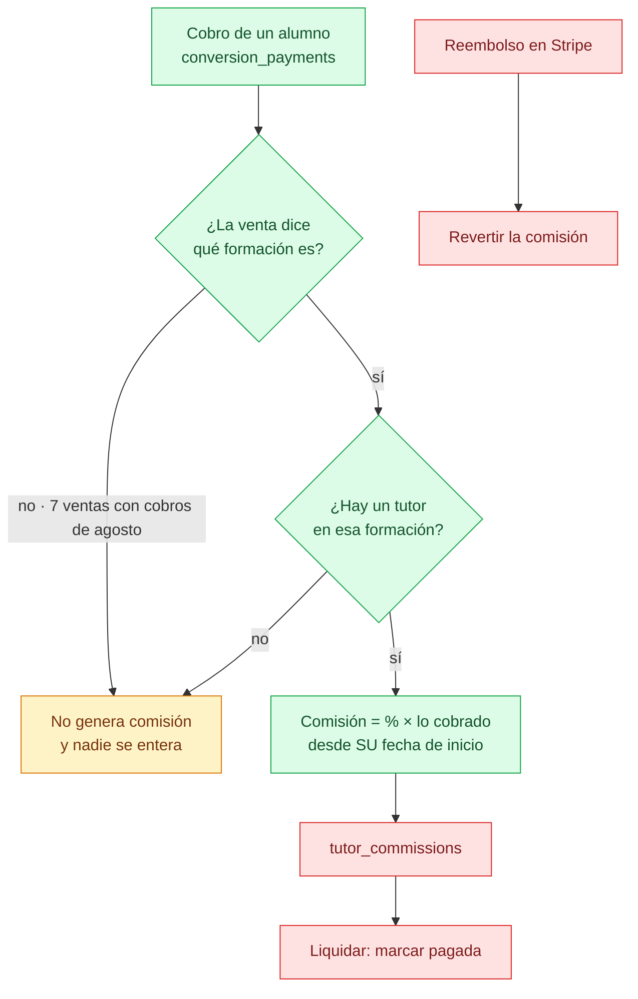
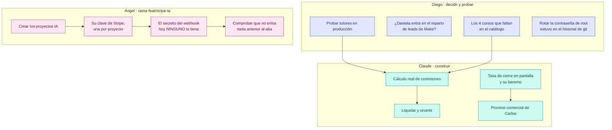
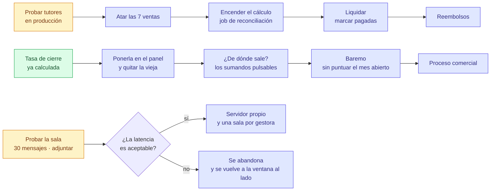
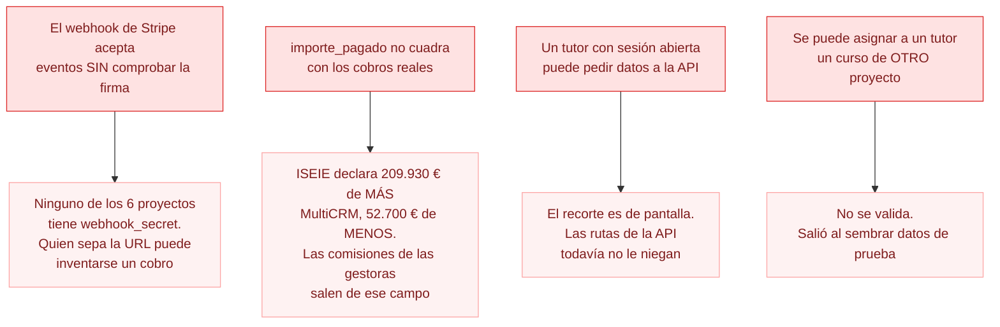
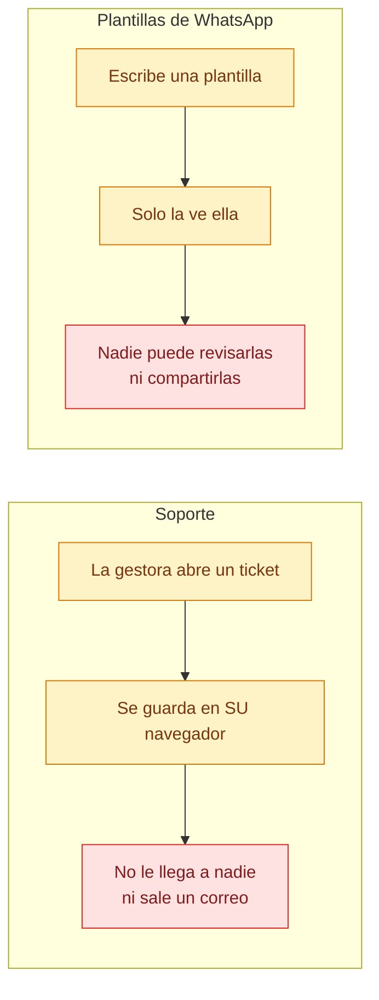
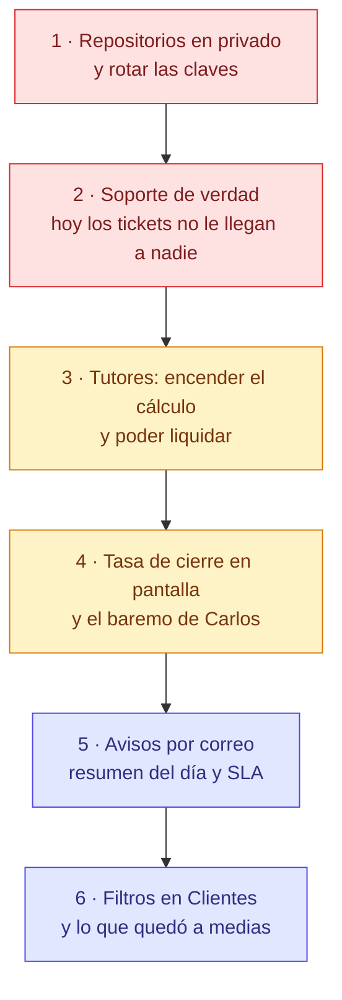

# Estado y pendientes

Al 4 de septiembre de 2026. Los diagramas se dibujan solos en GitHub.

Dos CRMs con **paridad absoluta**: lo que se hace en uno se hace en el otro,
salvo la marca y las rutas.

| | MultiCRM | ISEIE |
|---|---|---|
| Producción | `360crm.tech/crm/` | `crm.iseie.com` |
| Pruebas | `360crm.tech/testeo/` | `crm.iseie.com/staging/` |
| Proyectos | 9 | 1 |

---

## Dónde nos quedamos · 4 de septiembre

Tres semanas desde la foto anterior. Lo que ha cambiado, en orden de peso:

**WhatsApp está terminado y en producción, en los dos CRMs.** 96 commits entre
agosto y septiembre. Chat completo con audios, notas de voz y citas; grupos con
su etiqueta y el autor de cada mensaje; plantillas compartidas; banco de
mensajes (#101); el administrador entra en la sesión de cualquier gestora y
queda escrito quién miró qué. Lo único a medias son las **llamadas**: el aviso
entrante llega y se puede rechazar con un texto, pero hablar desde el CRM no —
por esa vía WhatsApp no da canal de audio. Sigue en investigación.

**Tutores paga de verdad.** Colaboraciones con vigencia y varias marcas, la
comisión calculada sobre lo cobrado —no sobre `importe_pagado`, que declara de
más—, el reembolso que la deshace, y los datos bancarios, que era literalmente
lo que impedía transferir.

**Duplicados (#102).** Detección por correo, teléfono normalizado y usuario de
WhatsApp; se vuelve a mirar al **completar** una ficha y no solo al crearla; y
la fusión se lleva varias fichas de una vez, arrastrando también el chat.
Al pasarlo sobre los datos reales salieron **313 grupos y 589 fichas** por
revisar entre los dos CRMs.

**Visibilidad entre gestoras (#109).** Seis puertas al mismo lead no
comprobaban de quién era: por ellas se leía y se escribía el historial de una
ficha ajena. Cerradas y probadas contra el código desplegado.

**El rediseño** avanza por bloques (#32, #33, #34, #78, #79). Del #79 solo
queda el punto 3, Ventas. Se aprueba cuando estén todas las ventanas.

### Lo que se rompió, y qué enseña

El 3 de septiembre, al fusionar 49 commits de Ángel, pasaron dos cosas que
conviene tener escritas:

1. **La fusión dejó fuera parte de su trabajo sin avisar.** Git registró los
   commits como antepasados pero no trajo el contenido: nueve ficheros enteros
   y varias funciones sueltas. Se descubrió porque la API no arrancaba. El
   barrido que lo cazó compara **función exportada por función exportada y ruta
   por ruta**, no lee el diff.

2. **Un alias escrito como cadena montó un router en la raíz.** Quedaron dos
   bloques haciendo lo mismo —uno esperaba lista, otro cadena— y recorrer una
   cadena con `for...of` da sus letras: la primera es `/`. Ese router pedía
   sesión, así que **todo lo público empezó a contestar 401**: el webhook de
   Make, el de formularios, el widget en seis webs y el de WhatsApp. Quince
   horas. Se recuperaron 81 mensajes de WhatsApp y tres leads.

   No saltó al desplegar porque la API no se reinició hasta cuatro horas
   después. **Desplegar y comprobar no es lo mismo que desplegar y reiniciar.**

### Lo que queda abierto y muerde

- **Los 313 grupos de duplicados** por revisar. Es trabajo de personas.
- **#110** · un cargo de Stripe de 2.730 € colgado de un curso de 390, y ya
  facturado a nombre de quien no lo pagó.
- **#71** · las tablas de producción son de `postgres` y no del usuario del
  CRM, así que cada `ALTER TABLE` hay que pasarlo a mano como `postgres`. El
  guion está escrito y sin aplicar.
- **La 132** no está aplicada en ninguno de los dos.
- **El #80 no está en ISEIE**: el panel de claves solo existe en MultiCRM.
- **945 cargos de Stripe sin asociar** en ISEIE.

---

## Dónde está cada cosa

```mermaid
flowchart LR
  subgraph PROD["🟢 En producción · los dos CRMs"]
    direction TB
    P1["Tutores<br/>alta · cursos · simulación"]
    P2["Facturación<br/>series · proformas · cuotas"]
    P3["Prospectos · Ventas<br/>Clientes · Matrículas"]
    P4["Stripe<br/>cobros y asociación"]
    P5["Meta Ads<br/>sincronización cada 3 h"]
  end

  subgraph STAG["🟡 Solo en pruebas"]
    direction TB
    S1["WhatsApp<br/>salas · plantillas · equipo"]
    S2["Tasa de cierre<br/>una sola definición"]
    S3["Stripe: factura desde<br/>el alta del proyecto"]
  end

  subgraph FALTA["🔴 Sin construir"]
    direction TB
    F1["Cálculo real<br/>de comisiones"]
    F2["Liquidar<br/>marcar como pagadas"]
    F3["Reembolsos<br/>revertir comisión"]
    F4["Proceso comercial<br/>qué toca hoy"]
  end

  STAG -->|"validar y subir"| PROD
  FALTA -->|"construir"| STAG

  classDef verde fill:#dcfce7,stroke:#16a34a,color:#14532d
  classDef ambar fill:#fef3c7,stroke:#d97706,color:#78350f
  classDef rojo fill:#fee2e2,stroke:#dc2626,color:#7f1d1d
  class P1,P2,P3,P4,P5 verde
  class S1,S2,S3 ambar
  class F1,F2,F3,F4 rojo
```

WhatsApp viaja en el mismo build que todo lo demás, pero **no se enseña en
producción**: `VITE_MODULOS_APAGADOS=whatsapp`. Se enciende quitando esa línea
y recompilando.

---

## Tutores · por qué todavía no paga

Está en producción y funciona, pero **es una simulación**. El dinero no existe
hasta que se cierre el camino entero:

**Verde** existe y está probado. **Rojo** no está escrito: `tutor_commissions`
es una tabla vacía en la que nadie escribe nunca, no hay forma de marcar una
comisión como pagada, y revertir por reembolso es imposible hoy porque
`conversion_refunds` no guarda a qué pago corresponde.

### Lo que hay que atar a mano

Como los tutores empiezan en agosto, **el histórico da igual**. Solo importan
las ventas que reciben cobros desde el 1 de agosto:

| | Ventas a atar | Dinero | De ellas, con nombre que casa con el catálogo |
|---|---|---|---|
| ISEIE | 6 | 1.347,34 € | 3 |
| MultiCRM | 1 | 133,33 € | 0 |

Las otras cuatro nombran cursos que **no existen en el catálogo**: «Apostilla de
la HAYA» (×2), «Máster trasplante capilar» y «Diplomado en Neurociencia
Aplicada». O se crean o se quedan fuera.

---

## Quién hace qué

---

## En qué orden, y qué depende de qué

---

## Lo que muerde si no se mira

---

## Media pantalla: lo que se ve pero no funciona

Son las peores, porque **nadie las reporta como error**: se usan, parece que van,
y no hacen nada. Todas comparten la misma causa — el frontal guarda en el
navegador de cada persona porque el backend no existe.

**Soporte** tiene 836 líneas de pantalla —formulario, lanzador, listado— y
**ningún módulo en el backend**. Su propio código lo dice: «cuando exista
`/api/tickets`…». Falta: tabla, endpoints, envío por Brevo al correo de destino,
adjuntos, y las métricas de cuánto se tarda en responder y en cerrar.

Las **plantillas de WhatsApp** ya están resueltas en la migración 122, pero esa
migración **no se ha aplicado en producción** porque WhatsApp está en espera.

Desde el 21/08/2026 eso ya no rompe nada: sin la 122 se devuelve lista vacía y
al intentar crear una plantilla se dice que falta un paso de instalación. Antes
subía un 500 en **cada carga del listado de prospectos** —de ahí sale el
desplegable— y el manejador escribe todos los 5xx en la tabla de errores, así
que una migración pendiente iba llenando el panel de soporte de ruido sin que
nadie relacionara una cosa con la otra.

Y recordar que **encender WhatsApp en producción es quitar
`VITE_MODULOS_APAGADOS=whatsapp`**, no solo aplicar migraciones. Mientras esté
puesto, el módulo viaja en el build pero ni se enseña en el menú ni consulta
nada por detrás.

---

## Automatismos de correo · nada de esto existe

Hay siete tareas programadas —Meta, Stripe, WooCommerce, secuencias,
recordatorios…— pero **ninguna de aviso interno**:

| Qué | A quién | Cuándo |
|---|---|---|
| Resumen del día | Gestora y administración | Al cerrar el día |
| Resumen semanal | Dirección | Lunes |
| Aviso de lead sin contactar | Gestora | A los 30 minutos |
| Plan de mañana | Gestora | Por la noche |

Se apoyan en Brevo, que ya está montado en los dos CRMs.

---

## Lo que quedó a medias

| Qué | Estado real |
|---|---|
| **Filtros en Clientes y Matrículas** | Prospectos guarda sus filtros en la URL; Clientes y Matrículas **no tienen ninguno**. Hay que replicar el juego entero |
| **Proformas: asociar a una venta ya creada** | Se puede elegir al emitir; falta el botón para las que ya existen |
| **Menú de Finanzas** | Plan aprobado y sin ejecutar: fusionar Ventas e Ingresos, y Conversiones como pestaña de Análisis |
| **Documento al convertir** | En pruebas de ISEIE; falta validarlo y subirlo a producción en los dos |
| **Modo BETA de ISEIE** | Aplicar el mismo corte al menú cuando se conecte WordPress |
| **Certificados de matrícula** | Usar los textos importados de los productos (módulos, profesores, horas) para el PDF |

---

## La cola larga

Medido, anotado y sin urgencia:

| Qué | Cuánto |
|---|---|
| Cargos de Stripe de 2026 sin enlazar | 501 · 152.098 € |
| Más cargos enlazables por importe y fecha | 241 |
| Teléfonos que `normalizePhone` estropea | 188 |
| Leads de CETLAT con su programa sin cruzar | 382 |
| Segundas cuotas registradas como venta nueva | por barrer |
| Proformas de ICTESS que consumen número de serie | por revisar |
| Tests que fallan por datos de ejemplo | 10 de 180 |
| Carlos no entra desde su WiFi fija | probar por IP directa |

---

## Por dónde seguir

Ordenado por lo que más duele, no por lo que más cuesta:

**Por qué en ese orden.** Lo primero no es negociable y no es código. Lo segundo
es lo único que hoy **engaña a quien lo usa**: una gestora escribe un ticket,
ve que se guarda, y no llega a ningún sitio. Lo tercero mueve dinero. Lo demás
mejora, pero nada de lo que hay hoy miente.

---

## Documentos relacionados

- [`tutores-pendiente.md`](tutores-pendiente.md) — el detalle del módulo
- [`tarea-stripe-proyectos-ia.md`](tarea-stripe-proyectos-ia.md) — la tarea de Ángel
- [`PARIDAD-ENTRE-CRMS.md`](PARIDAD-ENTRE-CRMS.md) — qué se copia y qué no
- [`INFORME-AGOSTO-2026.md`](INFORME-AGOSTO-2026.md) — el mes de WhatsApp y tutores, con las cifras sacadas del historial

---

## Dónde nos quedamos · 21 de agosto, noche

**En producción, funcionando:** WhatsApp unificado con el panel del admin,
historial de ventas del tutor, rutas en español con redirección, el menú nuevo,
los profesores de Psiko dados de alta con sus comisiones de agosto, y tres
ventas duplicadas de ISEIE cuadradas.

**En pruebas, esperando visto bueno:** el trabajo de Fabián (#31) y el de Ángel
(#45), fusionados sin conflictos. `/testeo` tiene además su propio WhatsApp, con
sesiones `testeo-uN` que no pueden tocar las de producción.

**Esperando a Diego:**
- Las migraciones **129 y 130** en producción. Aplicadas solo en pruebas.
- Las peticiones de cambios **#51** (Ángel) y **#52** (nuestra) contra `main`.
- Qué se hace con `main`, que en MultiCRM quedó adelantada y en ISEIE no.

**Corrige Ángel, no nosotros** — todo anotado en la #45: el aviso que nombra
variables de entorno, el recorrido que llega tarde y no salta pasos, la imagen
que se manda sin vista previa, la nota de voz sin aviso de envío y con la
duración equivocada.

**Lo nuestro, por orden:** recuperar contraseña (#37), Soporte de verdad (#38),
tasa de cierre de Carlos (#39), filtros en Clientes (#40) y la limpieza de datos
(#41, #42).

---

---

## WhatsApp en produccion — 21/08/2026

Lo que se probaba en pruebas ya corre en **los dos CRMs en produccion**: el chat
con las conversaciones dentro del CRM, una sesion por gestora, el admin viendo y
enlazando la de cada una, plantillas compartidas, notas de voz, responder a un
mensaje concreto, el recorrido guiado y la pagina de ayuda.

**El freno de escribir a desconocidos viene apagado.** Decision de Diego. Queda
apuntado en el registro quien escribe a un numero que no es prospecto, pero no se
impide: cuando el CRM se negaba, la gestora escribia desde su movil igual — sin
registro, sin plantilla y sin los topes de ritmo.

### Lo que hubo que arreglar para poder subirlo

Lo que corria en pruebas **no estaba en ninguna rama entera**: era el trabajo de
Angel con tres cambios nuestros copiados a mano encima. Al juntarlo salieron dos
cosas:

- **El freno tenia dos nombres con significados opuestos** —el suyo encendia, el
  nuestro apagaba—. Queda uno solo, `WA_BLOQUEO_DESCONOCIDOS`, apagado. Si algun
  `.env` conserva el viejo `WA_EXIGIR_CONSENTIMIENTO`, el servidor lo ignora y lo
  avisa al arrancar en vez de obedecerlo en silencio.
- **Una funcion rota en los dos entornos de pruebas.** `chat.controller.js`
  llamaba a `ultimoLatido`, que `chat.service.js` ya no exportaba: lo pise al
  copiar ese fichero suelto. `/api/whatsapp/sincronizacion` —lo que pregunta si
  sigue entrando historial— reventaba. Arreglado en los cuatro entornos.

Esa es la moraleja: **copiar ficheros sueltos a un servidor rompe cosas en
silencio**. Lo que se sube, se sube desde una rama.

### Como quedo cada sitio

| | Migraciones 129 y 130 | Modulo | Frontal |
|---|---|---|---|
| MultiCRM produccion | aplicadas | 11 ficheros | publicado, ayuda incluida |
| ISEIE produccion | aplicadas | 11 ficheros | publicado, ayuda incluida |
| MultiCRM pruebas | ya estaban | al dia | sin tocar |
| ISEIE pruebas | pendiente | al dia | sin tocar |

Copias de seguridad antes de tocar: `crm_prod_db` 9,6 MB y `crm_iseie` 7,7 MB en
`/var/backups/crm/`. Las conversaciones que ya habia siguen ahi, y la sesion
conectada de ISEIE (`crm-u16`) aguanto el reinicio.

### El atasco de Evolution en ISEIE — 21/08/2026

Sintoma: se enlazo el numero de una gestora, se veia «conectado», y no salia ni
entraba nada. El CRM decia «enviado» y el mensaje no llegaba a ningun sitio.

**Evolution llevaba parado desde las 09:06 de esa manana.** Su propia base no
guardo ni un mensaje en todo el dia. La traza:

    await _o.emit -> retryWebhookRequest -> AxiosError: timeout of 60000ms
    url: http://172.17.0.1:3005/api/whatsapp/webhook

Evolution **espera** a que su aviso llegue antes de seguir con el evento. Como el
aviso no llegaba, cada uno se comia 60 segundos y luego reintentaba: 109 en 12
minutos. La cola entera parada. Por eso no salian los mensajes ni entraban los
que escribian.

**La causa: ufw esta activo en esta maquina** —en la de MultiCRM no— y cortaba
lo que venia del contenedor. Y el detalle que costo encontrar: **el contenedor no
esta en `docker0` (172.17.0.1) sino en su propia red de compose,
`whatsapp_default` (172.18.0.0/16, puente `br-7ff3422bc513`)**. La primera regla
se puso sobre docker0 y no sirvio de nada.

La regla buena, por subred y no por nombre de puente —si se recrea la red, el
puente cambia de nombre y la regla dejaria de valer sin que nadie se entere—:

    ufw allow from 172.16.0.0/12 to any port 3005 proto tcp

Solo abre el puerto del CRM a la red privada de docker. No expone nada a
internet, no toca los 8 sitios de terceros de la maquina y se deshace con
`ufw delete`. No hizo falta reiniciar el contenedor ni volver a enlazar ningun
numero.

En cuanto entro, la cola se vacio sola: Evolution paso de las 09:06 a la hora
real y el CRM de 4 mensajes a 35.

**Como reconocerlo la proxima vez:** si el numero sale «conectado» pero no se
mueve nada, mirar `docker logs crm-whatsapp | grep 'timeout of 60000ms'`. Si hay
tiempos agotados, el problema no es WhatsApp ni el CRM: es que Evolution no
alcanza al CRM.

### Evolution tiene que guardar los mensajes — 24/08/2026

Los dos contenedores venian con `DATABASE_SAVE_DATA_NEW_MESSAGE: "false"` y
`DATABASE_SAVE_MESSAGE_UPDATE: "false"`. Suena razonable —el CRM ya guarda su
copia, para que duplicar— hasta que alguien pulsa **«Descargar audio»**: el CRM le
pide el fichero a Evolution por el identificador del mensaje y Evolution contesta
`Message not found`, porque nunca lo guardo. De ahi el «este archivo ya no se
puede recuperar».

Y lo segundo, menos visible: sin `SAVE_MESSAGE_UPDATE` **los tics no avanzan
nunca**. Los acuses de WhatsApp llegan, pero Evolution no puede emparejarlos con
un mensaje que no tiene, asi que todo se queda en un tic aunque este entregado.

Las dos encendidas en los dos servidores. Recrear el contenedor **no desenlaza
nada**: la sesion vive en su base de datos y vuelve sola en unos segundos —
comprobado dos veces, con una gestora trabajando.

### Los sintomas que confunden

Merece la pena tenerlos juntos, porque los tres se parecen y son cosas distintas:

| Lo que se ve | Que es |
|---|---|
| «Conectado» pero no se mueve nada | Evolution no alcanza al CRM. Mirar los tiempos agotados |
| Un tic que nunca avanza | Evolution no guarda las actualizaciones |
| «El archivo ya no se puede recuperar» | Evolution no guarda los mensajes |
| El chat con el nombre de la gestora | `pushName` guardado en un mensaje que sale |

Ninguno es que WhatsApp haya tumbado el numero, que es lo primero que uno teme.

### Las rutas del frontal contra las del servidor — 24/08/2026

Tres veces el mismo fallo en un dia: al pasar las rutas a español se renombraron
las llamadas del frontal y **no** los prefijos del servidor. Pantallas enteras
pidiendo a una direccion que no contestaba, sin que nadie lo notara hasta que
alguien abria esa pantalla.

| Modulo | El frontal pide | El servidor servia |
|---|---|---|
| Informes | `/api/informes` | `/api/reports` |
| Ventas | `/api/ventas` | `/api/sales` |
| Secuencias de email | `/api/secuencias-email` | `/api/email-sequences` |
| Mensajes (MultiCRM) | `/api/mensajes` | `/api/messages` |

Los cuatro pasan a su nombre en español y **conservan el viejo con `alias`**, que
no cuesta nada y evita romper integraciones o pestañas abiertas.

**Para que no haya una quinta vez:** `scripts/auditoria_rutas.py`. Saca los
prefijos y rutas de cada modulo del servidor, las llamadas del frontal con su
fichero y su linea, y las cruza. Se corre sin tocar ningun servidor:

    python scripts/auditoria_rutas.py

Antes de esto: **21 llamadas huerfanas en MultiCRM y 14 en ISEIE**. Despues:
ninguna en los dos. Conviene pasarlo antes de cada despliegue grande, y
obligatoriamente despues de renombrar cualquier ruta.

Ojo con leerlo mal: se compara **por prefijo**, no por camino exacto. Una llamada
como `/leads/${id}` llega al analisis como `/api/leads`, asi que lo que se
detecta es que el servidor no tenga NADA colgando de ahi — que es justo el fallo
del renombrado.

### Lo que falta

- **ISEIE pruebas no tiene Evolution configurado** en su `.env`, asi que alli el
  WhatsApp no se puede probar. Si se quiere, hay que darle su propio prefijo de
  sesion y su webhook, como se hizo con MultiCRM pruebas.
- **Lo de Angel de la tarea #45** sigue como estaba: el aviso de configuracion
  que se le ensena a la gestora, la vista previa de la imagen antes de mandarla,
  el estado de «enviando» del audio y su duracion.
- **Paridad de rutas**: en ISEIE `/leads` y `/clients` siguen en ingles; en
  MultiCRM ya son `/prospectos` y `/clientes`. El resto de rutas si coinciden.

---

<!-- INDICE-TAREAS -->

## Todas las tareas abiertas

Sacado de GitHub el 04/09/2026, no escrito a mano: **52 abiertas**.
Para volver a generarlo, `scratchpad/actualizar_estado.py`.

### sin fase · 13

- **#98** Factura 2026/0752 (ISEIE): decidir a quién pertenece antes de enviarla — *sin asignar*
- **#99** WhatsApp: los cinco arreglos de la interfaz que salieron al probar los grupos — *Ángel*
- **#100** Ventas: vista de todos los proyectos y separar ventas de mensualidades — *sin asignar*
- **#101** WhatsApp: un banco de mensajes, en tabla y por número, con copia de seguridad — *Ángel*
- **#103** Ver todos los proyectos AGRUPADOS POR SOCIEDAD, no solo todos juntos — *sin asignar*
- **#104** Clientes con la vista de Prospectos, adaptada — no calcada — *Fabián*
- **#105** Un icono para cada sección principal del menú — *Fabián*
- **#106** Los formularios, con el mismo formato en todo el CRM — sin tocar los campos — *Fabián*
- **#107** Secciones de seguimiento: primero, segundo, tercero… como un plan — *sin asignar*
- **#110** Sandra Gaitan (ISEIE): un cargo de Stripe de 2.730 EUR colgado de un curso de 390, y ya facturado — *sin asignar*
- **#111** Notificaciones del CRM de pie a cabeza, y un registro de logs con vista general y todos — *Ángel*
- **#112** WhatsApp: la ficha en popup solo se mira, la foto se pierde al abrir el chat, y el buscador de reenviar no encuentra — *Ángel*
- **#113** Aviso: la fusion perdio parte de tu trabajo (repuesto), el panel de claves ya tiene menu, y falta portar el #80 a ISEIE — *Ángel*

### Fase 2 · Construir · 19

- **#30** Análisis de datos con IA — *Ángel*
- **#32** Rediseño · tokens y primitivas — *Fabián*
- **#33** Rediseño · el marco: menú, cabecera y estructura — *Fabián*
- **#34** Rediseño · las 82 pantallas, por bloques — *Fabián*
- **#35** Proceso de ventas editable — *Diego*
- **#36** Search Console — *Diego*
- **#37** Recuperar la contraseña por correo — *sin asignar*
- **#38** Soporte de verdad — *sin asignar*
- **#39** Tasa de cierre y baremo · lo de Carlos — *sin asignar*
- **#44** Sincronizar los proyectos de IA con el CRM · Ángel y Fabián — *Fabián, Ángel*
- **#48** Recibir el origen de los leads (ChatGPT incluido) y categorizarlo — *Diego*
- **#78** Rediseño · llevar todas las pantallas al estilo SuiteDash de /testeo2 — *Fabián*
- **#79** Rediseño · lo que hay que corregir de la primera vuelta (revisado en /testeo) — *Fabián*
- **#86** Proceso · A · Plazas y cierre de convocatoria en el catálogo — *sin asignar*
- **#87** Proceso · B · Los cinco pasos, en la base y editables — *sin asignar*
- **#88** Proceso · C · Las plantillas de los cinco pasos, cargadas y rellenas — *sin asignar*
- **#89** Proceso · D · «Qué toca hoy con este lead», en su ficha — *sin asignar*
- **#90** Proceso · E · La cola del día: a quién le toca hoy — *sin asignar*
- **#91** Proceso · F · Las reglas que el CRM hace cumplir solo — *sin asignar*

### Fase 1 · Desbloquear · 5

- **#22** Clave de IA y tope de gasto — *Diego*
- **#24** Decidir qué pasa con main — *Diego*
- **#63** WhatsApp: dos endpoints que solo existen en el puente de Baileys, no en Evolution — *Ángel*
- **#67** WhatsApp: el botón de llamar no hace nada en el ordenador — *Ángel*
- **#71** Las tablas de producción son de postgres, no del usuario del CRM — *Diego*

### Fase 4 · Medir · 6

- **#53** Meta Ads: del gasto a la venta, no al lead — *sin asignar*
- **#54** Google Ads: traer campañas y gasto al CRM — *sin asignar*
- **#55** Google Analytics: lo que pasa antes del lead — *sin asignar*
- **#56** Panel de canales: dónde poner el dinero — *sin asignar*
- **#57** Pedirle a Daniela sus reportes de publicidad y ventas — *Diego*
- **#66** Manual de usuario y vídeos tutoriales, por apartado y general — *Diego, Ángel*

### Fase 3 · Cerrar · 9

- **#2** Frontend: Dropdown categorías searchable + niveles separados cascade — *Diego, Ángel*
- **#6** Frontend: Panel UI de conectores con preview + mapping visual — *Fabián, Ángel*
- **#11** Frontend: Panel 'próximo gestor' en /leads — visualizar round-robin — *Diego, Fabián, Ángel*
- **#13** Backend: Activity feed (tabla + endpoint para 'qué pasó hoy') — *Diego*
- **#14** Backend: WooCommerce orders sync + cron flexible (manual/diario/semanal) — *Diego*
- **#40** Filtros en Clientes y Matrículas — *sin asignar*
- **#41** Ventas sin formación identificada · 321 — *sin asignar*
- **#42** Los otros datos que no cuadran — *sin asignar*
- **#43** Lo que quedó a medias — *sin asignar*

<!-- FIN-INDICE-TAREAS -->
